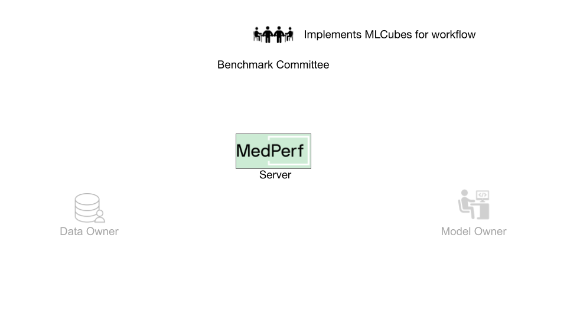
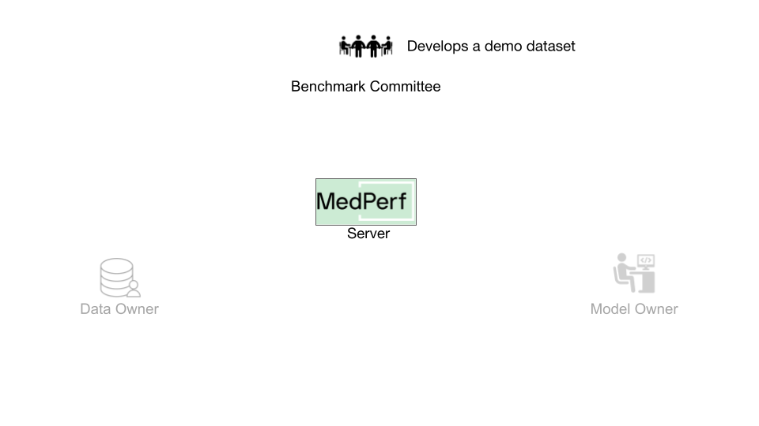
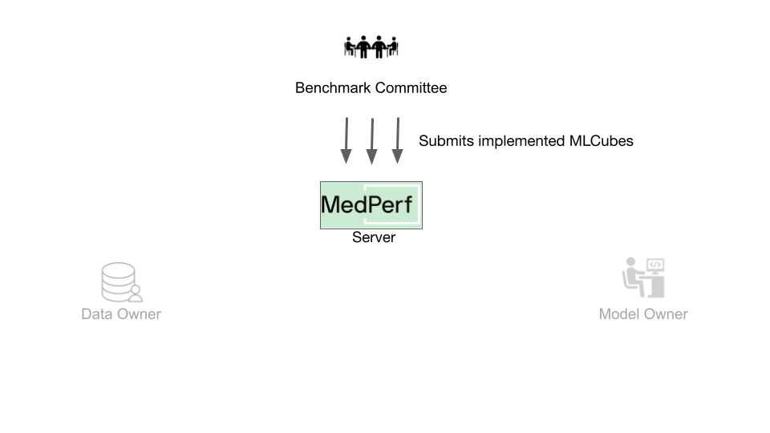
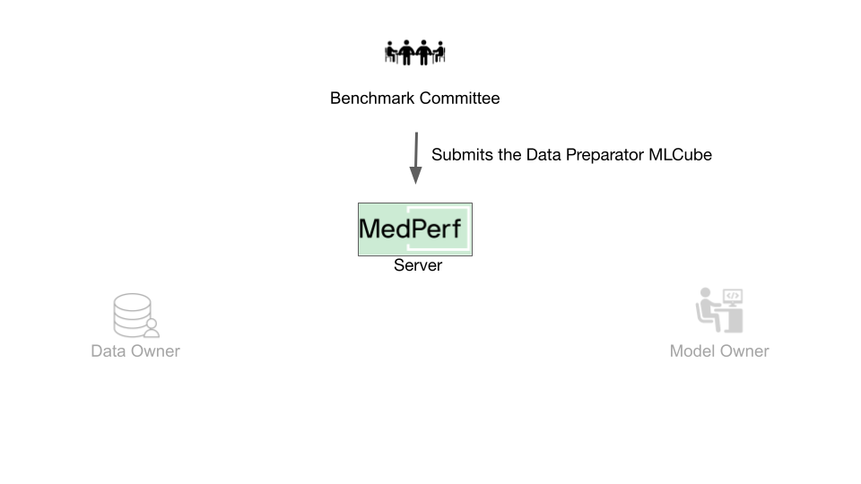

{class="tutorial-sticky-image-content"}

# Hands-on Tutorial for Bechmark Committee








## Overview

In this guide, you will learn how a user can use MedPerf to create a benchmark. The key tasks can be summarized as follows:

1. Implement a valid workflow.
2. Develop a demo dataset.
3. Test your workflow.
4. Submitting the MLCubes to the MedPerf server.
5. Host the demo dataset.
6. Submit the benchmark to the MedPerf server.

It's assumed that you have already set up the general testing environment as explained in the [setup guide](setup.md).




## 1. Implement a Valid Workflow

{class="tutorial-sticky-image-content"}
The implementation of a valid workflow is accomplished by implementing three [MLCubes](../mlcubes/mlcubes.md):

1. **Data Preparator MLCube:** This MLCube will transform raw data into a dataset ready for the AI model execution. All data owners willing to participate in this benchmark will have their data prepared using this MLCube. A guide on how to implement data preparation MLCubes can be found [here](../mlcubes/mlcube_data.md).

2. **Reference Model MLCube:** This MLCube will contain an example model implementation for the desired AI task. It should be compatible with the data preparation MLCube (i.e., the outputs of the data preparation MLCube can be directly fed as inputs to this MLCube). A guide on how to implement model MLCubes can be found [here](../mlcubes/mlcube_models.md).

3. **Metrics MLCube:** This MLCube will be responsible for evaluating the performance of a model. It should be compatible with the reference model MLCube (i.e., the outputs of the reference model MLCube can be directly fed as inputs to this MLCube). A guide on how to implement metrics MLCubes can be found [here](../mlcubes/mlcube_metrics.md).

For this tutorial, you are provided with following three already implemented mlcubes for the task of chest X-ray classification. The implementations can be found in the following links: [Data Preparator](https://github.com/mlcommons/medperf/tree/main/examples/chestxray_tutorial/data_preparator), [Reference Model](https://github.com/mlcommons/medperf/tree/main/examples/chestxray_tutorial/model_custom_cnn), [Metrics](https://github.com/mlcommons/medperf/tree/main/examples/chestxray_tutorial/metrics). These mlcubes are setup locally for you and can be found in your workspace folder under `data_preparator`, `model_custom_cnn`, and `metrics`.

## 2. Develop a Demo Dataset

{class="tutorial-sticky-image-content"}
A demo dataset is a small reference dataset. It contains a few data records and their labels, which will be used to test the benchmark's workflow in two scenarios:

1. It is used for testing the benchmark's default workflow. The MedPerf client automatically runs a compatibility test of the benchmark's three mlcubes prior to its submission. The test is run using the benchmark's demo dataset as input.

2. When a model owner wants to participate in the benchmark, the MedPerf client tests the compatibility of their model with the benchmark's data preparation cube and metrics cube. The test is run using the benchmark's demo dataset as input.

For this tutorial, you are provided with a demo dataset for the chest X-ray classification workflow. The dataset can be found in your workspace folder under `demo_data`. It is a small dataset comprising two chest X-ray images and corresponding thoracic disease labels.

You can test the workflow now that you have the three MLCubes and the demo data. Testing the workflow before submitting any asset to the MedPerf server is usually recommended.

## 3. Test your Workflow

MedPerf provides a single command to test an inference workflow. To test your workflow with local MLCubes and local data, the following need to be passed to the command:

1. Path to the data preparation MLCube manifest file: `medperf_tutorial/data_preparator/mlcube/mlcube.yaml`.
2. Path to the model MLCube manifest file: `medperf_tutorial/model_custom_cnn/mlcube/mlcube.yaml`.
3. Path to the metrics MLCube manifest file: `medperf_tutorial/metrics/mlcube/mlcube.yaml`.
4. Path to the demo dataset data records: `medperf_tutorial/demo_data/images`.
5. Path to the demo dataset data labels. `medperf_tutorial/demo_data/labels`.

Run the following command to execute the test ensuring you are in MedPerf's root folder:

```bash
medperf test run \
   --data_preparation "medperf_tutorial/data_preparator/mlcube/mlcube.yaml" \
   --model "medperf_tutorial/model_custom_cnn/mlcube/mlcube.yaml" \
   --evaluator "medperf_tutorial/metrics/mlcube/mlcube.yaml" \
   --data_path "medperf_tutorial/demo_data/images" \
   --labels_path "medperf_tutorial/demo_data/labels"
```

Assuming the test passes successfully, you are ready to submit the MLCubes to the MedPerf server.

## 4. Host the Demo Dataset

The demo dataset should be packaged in a specific way as a compressed tarball file. The folder stucture in the workspace currently looks like the following:

```text
.
└── medperf_tutorial
    ├── demo_data
    │   ├── images
    │   └── labels
    │
    ...
```

The goal is to package the folder `demo_data`. You must first create a file called `paths.yaml`. This file will provide instructions on how to locate the data records path and the labels path. The `paths.yaml` file should specify both the data records path and the labels path.

In your workspace directory (`medperf_tutorial`), create a file `paths.yaml` and fill it with the following:

```text
data_path: demo_data/images
labels_path: demo_data/labels
```

!!! note
    The paths are determined by the Data Preparator MLCube's expected input path.

After that, the workspace should look like the following:

```text
.
└── medperf_tutorial
    ├── demo_data
    │   ├── images
    │   └── labels
    ├── paths.yaml
    │
    ...
```

Finally, compress the required assets (`demo_data` and `paths.yaml`) into a tarball file by running the following command in your workspace directory:

```bash
tar -czf demo_data.tar.gz demo_data paths.yaml
```

And that's it! Now you have to host the tarball file (`demo_data.tar.gz`) on the internet.

For the tutorial to run smoothly, the file is already hosted at the following URL:

```text
{{ demo_url }}
```

If you wish to host it by yourself, you can find the list of supported options and details about hosting files in [this page](../concepts/hosting_files.md).

Finally, now after having the MLCubes submitted and the demo dataset hosted, you can submit the benchmark to the MedPerf server.

## 5. Submitting the MLCubes

{class="tutorial-sticky-image-content"}
### How does MedPerf Recognize an MLCube?



To prepare the files of the three MLCubes, run the following command ensuring you are in MedPerf's root folder:

```bash
python scripts/package-mlcube.py --mlcube medperf_tutorial/data_preparator/mlcube --mlcube-types data-preparator
python scripts/package-mlcube.py --mlcube medperf_tutorial/model_custom_cnn/mlcube --mlcube-types model
python scripts/package-mlcube.py --mlcube medperf_tutorial/metrics/mlcube --mlcube-types metrics
```

For each MLCube, this script will create a new folder named `assets` in the MLCube directory. This folder will contain all the files that should be hosted separately.



### Submit the MLCubes

#### Data Preparator MLCube

{class="tutorial-sticky-image-content"}
For the Data Preparator MLCube, the submission should include:

- The URL to the hosted mlcube manifest file, which is:

    ```text
    {{ prep_mlcube }}

    ```

- The URL to the hosted mlcube parameters file, which is:

    ```text
    {{ prep_params }}
    ```

Use the following command to submit:

```bash
medperf mlcube submit \
    --name my-prep-cube \
    --mlcube-file "{{ prep_mlcube }}" \
    --parameters-file "{{ prep_params }}" \
```

#### Reference Model MLCube

{class="tutorial-sticky-image-content"}
For the Reference Model MLCube, the submission should include:

- The URL to the hosted mlcube manifest file:

    ```text
    {{ model_mlcube }}
    ```

- The URL to the hosted mlcube parameters file:

    ```text
    {{ model_params }}
    ```

- The URL to the hosted additional files tarball file:

    ```text
    {{ model_add }}
    ```

Use the following command to submit:

```bash
medperf mlcube submit \
--name my-modelref-cube \
--mlcube-file "{{ model_mlcube }}" \
--parameters-file "{{ model_params }}" \
--additional-file "{{ model_add }}"
```

#### Metrics MLCube

{class="tutorial-sticky-image-content"}
For the Metrics MLCube, the submission should include:

- The URL to the hosted mlcube manifest file:

    ```text
    {{ metrics_mlcube }}
    ```

- The URL to the hosted mlcube parameters file:

    ```text
    {{ metrics_params }}
    ```

Use the following command to submit:

```bash
medperf mlcube submit \
--name my-metrics-cube \
--mlcube-file "{{ metrics_mlcube }}" \
--parameters-file "{{ metrics_params }}" \
```

Each of the three MLCubes will be assigned by a server UID. You can check the server UID for each MLCube by running:

```bash
medperf mlcube ls --mine
```

Next, you will learn how to host the demo dataset.

## 6. Submit your Benchmark

{class="tutorial-sticky-image-content"}
You need to keep at hand the following information:

- The Demo Dataset URL. Here, the URL will be:

```text
{{ demo_url }}
```

- The server UIDs of the three MLCubes:
    - Data preparator UID: `1`
    - Reference model UID: `2`
    - Evaluator UID: `3`

You can create and submit your benchmark using the following command:

```bash
medperf benchmark submit \
   --name tutorial_bmk \
   --description "MedPerf demo bmk" \
   --demo-url "{{ demo_url }}" \
   --data-preparation-mlcube 1 \
   --reference-model-mlcube 2 \
   --evaluator-mlcube 3
```

The MedPerf client will first automatically run a compatibility test between the MLCubes using the demo dataset. If the test is successful, the benchmark will be submitted along with the compatibility test results.

!!! note
    The benchmark will stay inactive until the MedPerf server admin approves your submission.

That's it! You can check your benchmark's server UID by running:

```bash
medperf benchmark ls --mine
```

{class="tutorial-sticky-image-content"}


## See Also

- [Benchmark Associations.](../concepts/associations.md)
- [Models Priorities](../concepts/priorities.md)
