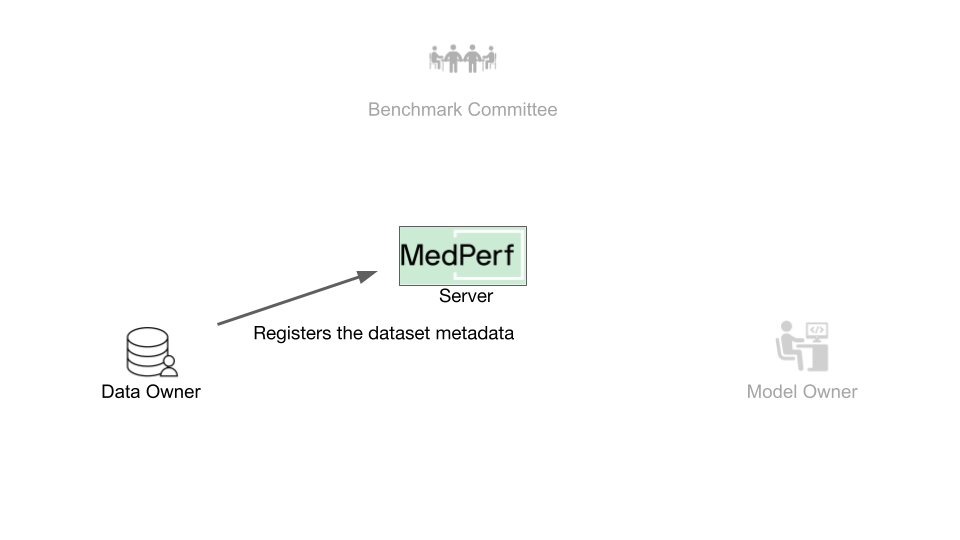
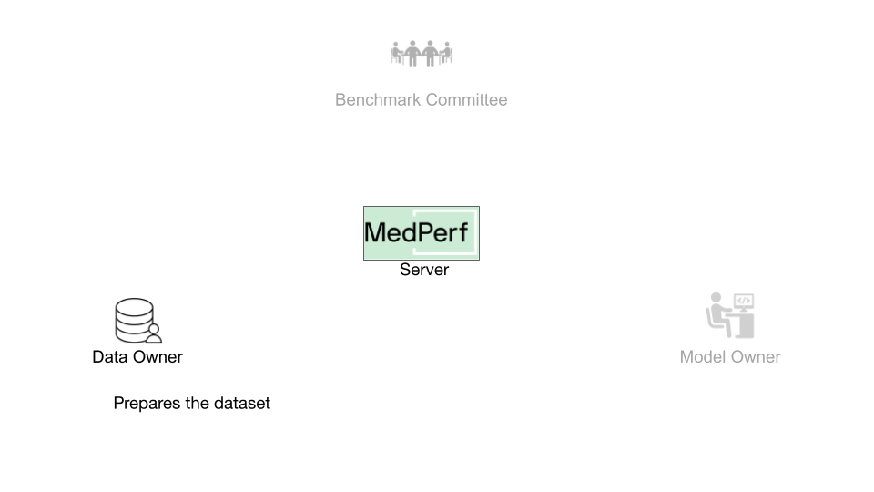
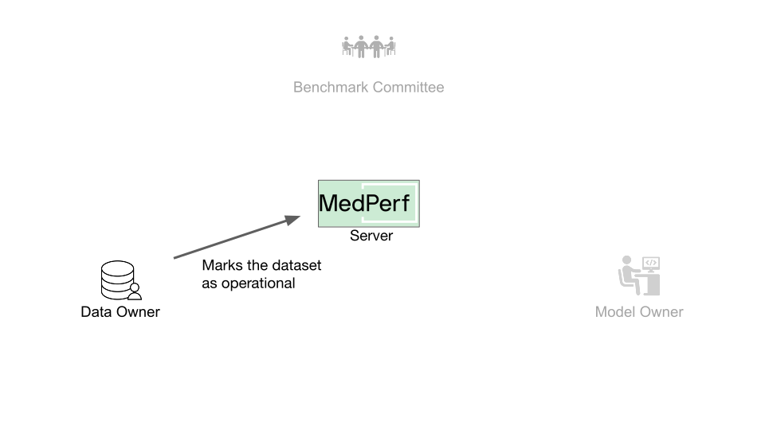

{class="tutorial-sticky-image-content"}

# Hands-on Tutorial for Data Owners

## Overview

As a data owner, you plan to run a benchmark on your own dataset. Using MedPerf, you will prepare your (raw) dataset and submit information about it to the MedPerf server. You may have to consult the benchmark committee to make sure that your raw dataset aligns with the benchmark's expected input format.

!!!Note
    A key concept of MedPerf is the stringent confidentiality of your data. It remains exclusively on your machine. Only minimal information about your dataset, such as the hash of its contents, is submitted. Once your Dataset is submitted and associated with a benchmark, you can run all benchmark models on your data within your own infrastructure and see the results / predictions.

This guide provides you with the necessary steps to use MedPerf as a Data Owner. The key tasks can be summarized as follows:

1. Register your data information.
2. Prepare your data.
3. Mark your data as operational.
4. Request participation in a benchmark.
5. Execute the benchmark models on your dataset.
6. Submit a result.

It is assumed that you have the general testing environment [set up](setup.md).



## 1. Register your Data Information

{class="tutorial-sticky-image-content"}
To register your dataset, you need to collect the following information:

- A name you wish to have for your dataset.
- A small description of the dataset.
- The source location of your data (e.g., hospital name).
- The path to the data records (here, it is `medperf_tutorial/sample_raw_data/images`).
- The path to the labels of the data (here, it is `medperf_tutorial/sample_raw_data/labels`)
- The benchmark ID that you wish to participate in. This ensures your data in the next step will be prepared using the benchmark's data preparation MLCube.

!!! note
    The `data_path` and `labels_path` are determined according to the input path requirements of the data preparation MLCube. To ensure that your data is structured correctly, it is recommended to check with the Benchmark Committee for specific details or instructions.

In order to find the benchmark ID, you can execute the following command to view the list of available benchmarks.

```bash
medperf benchmark ls
```

The target benchmark ID here is `1`.

!!! note
    You will be submitting general information about the data, not the data itself. The data never leaves your machine.

Run the following command to register your data (make sure you are in MedPerf's root folder):

```bash
medperf dataset submit \
  --name "mytestdata" \
  --description "A tutorial dataset" \
  --location "My machine" \
  --data_path "medperf_tutorial/sample_raw_data/images" \
  --labels_path "medperf_tutorial/sample_raw_data/labels" \
  --benchmark 1
```

Once you run this command, the information to be submitted will be displayed on the screen and you will be asked to confirm your submission. Once you confirm, your dataset will be successfully registered!

## 2. Prepare your Data

{class="tutorial-sticky-image-content"}

To prepare and preprocess your dataset, you need to know the server UID of your registered dataset. You can check your datasets information by running:

```bash
medperf dataset ls --mine
```

In our tutorial, your dataset ID will be `1`. Run the following command to prepare your dataset:

```bash
medperf dataset prepare --data_uid 1
```

This command will also calculate statistics on your data; statistics defined by the benchmark owner. These will be submitted to the MedPerf server in the next step upon your approval.

## 3. Mark your Dataset as Operational

{class="tutorial-sticky-image-content"}

After successfully preparing your dataset, you can mark it as ready so that it can be associated with benchmarks you want. During preparation, your dataset is considered in the `Development` stage, and now you will mark it as operational.

!!! note
    Once marked as operational, it can never be marked as in-development anymore.

Run the following command to mark your dataset as operational:

```bash
medperf dataset set_operational --data_uid 1
```

Once you run this command, you will see on your screen the updated information of your dataset along with the statistics mentioned in the previous step. You will be asked to confirm submission of the displayed information. Once you confirm, your dataset will be successfully marked as operational!

Next, you can proceed to request participation in the benchmark by initiating an association request.

## 4. Request Participation

{class="tutorial-sticky-image-content"}
For submitting the results of executing the benchmark models on your data in the future, you must associate your data with the benchmark.

Once you have submitted your dataset to the MedPerf server, it will be assigned a server UID, which you can find by running `medperf dataset ls --mine`. Your dataset's server UID is also `1`.

Run the following command to request associating your dataset with the benchmark:

```bash
medperf dataset associate --benchmark_uid 1 --data_uid 1
```

This command will first run the benchmark's reference model on your dataset to ensure your dataset is compatible with the benchmark workflow. Then, the association request information is printed on the screen, which includes an executive summary of the test mentioned. You will be prompted to confirm sending this information and initiating this association request.

#### How to proceed after requesting association

{class="tutorial-sticky-image-content"}
When participating with a real benchmark, you must wait for the Benchmark Committee to approve the association request. You can check the status of your association requests by running `medperf association ls -bd`. The association is identified by the server UIDs of your dataset and the benchmark with which you are requesting association.

_For the sake of continuing the tutorial only_, run the following to simulate the benchmark committee approving your association (make sure you are in the MedPerf's root directory):

```bash
sh tutorials_scripts/simulate_data_association_approval.sh
```

You can verify if your association request has been approved by running `medperf association ls -bd`.

## 5. Execute the Benchmark

{class="tutorial-sticky-image-content"}
MedPerf provides a command that runs all the models of a benchmark effortlessly. You only need to provide two parameters:

- The benchmark ID you want to run, which is `1`.
- The server UID of your data, which is `1`.

For that, run the following command:

```bash
medperf benchmark run --benchmark 1 --data_uid 1
```

After running the command, you will receive a summary of the executions. You will see something similar to the following:

```text
  model  local result UID    partial result    from cache    error
-------  ------------------  ----------------  ------------  -------
      5  b1m5d1              False             False
      3  b1m3d1              False             True
Total number of models: 2
        1 were skipped (already executed), of which 0 have partial results
        0 failed
        1 ran successfully, of which 0 have partial results

✅ Done!
```

This means that the benchmark has two models:

- A model that you already ran when you requested the association. This explains why it was skipped.
- Another model that ran successfully. Its result generated UID is `b1m5d1`.

You can view the results by running the following command with the specific local result UID. For example:

```bash
medperf result view b1m5d1
```

For now, your results are only local. Next, you will learn how to submit the results.

## 6. Submit a Result

{class="tutorial-sticky-image-content"}
After executing the benchmark, you will submit a result to the MedPerf server. To do so, you have to find the target result generated UID.

As an example, you will be submitting the result of UID `b1m5d1`. To do this, run the following command:

```bash
medperf result submit --result b1m5d1
```

The information that is going to be submitted will be printed to the screen and you will be prompted to confirm that you want to submit.

{class="tutorial-sticky-image-content"}


<!--
TODO: uncomment once single_run is filled.
## See Also

- [Running a Single Model.](../concepts/single_run.md)
-->
