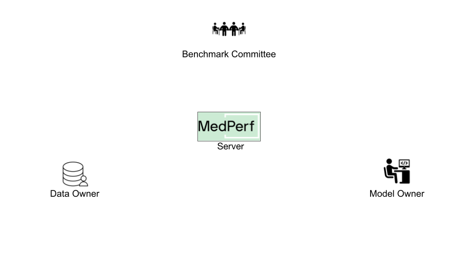
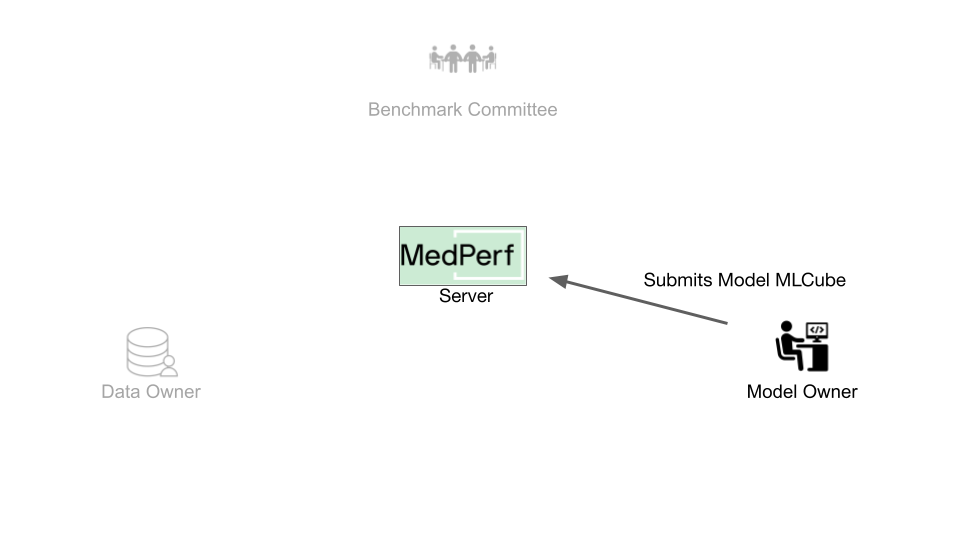
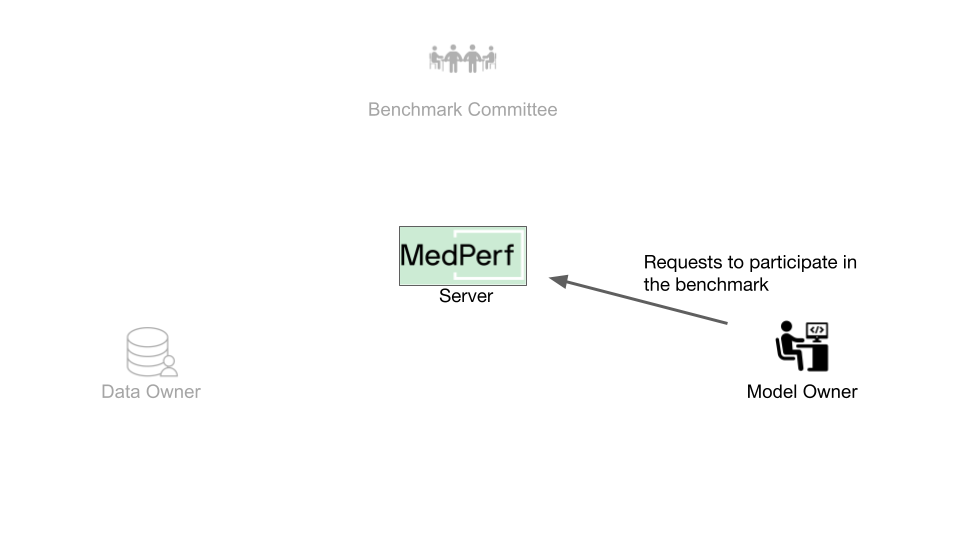
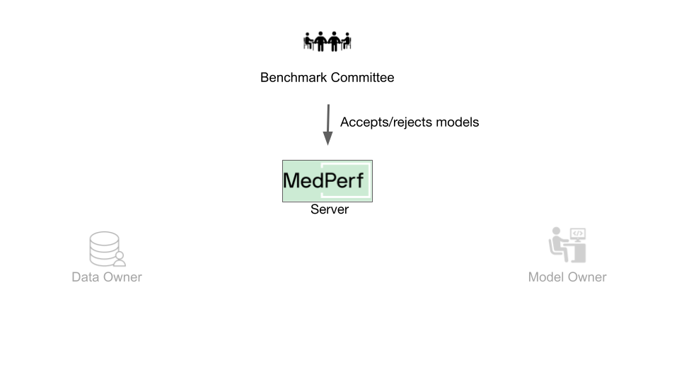
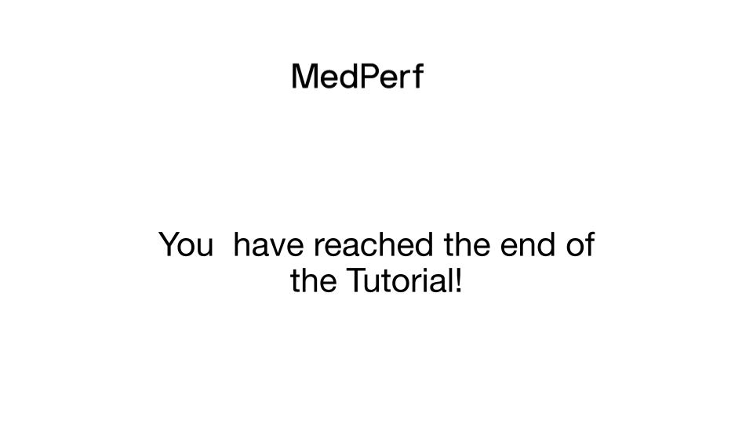

{class="tutorial-sticky-image-content"}

# Hands-on Tutorial for Model Owners




## Overview

In this guide, you will learn how a Model Owner can use MedPerf to take part in a benchmark. Usually as a model owner you may be also interested in how to build a [MedPerf-compatible model container](../containers/containers.md#model-container). But this guide provides an already implemented container if you want to directly proceed to learn how to interact with MedPerf.

The main tasks of this guide are:

1. A few notes about your model compatibility
2. Submitting the model.
3. Requesting participation in a benchmark.

It's assumed that you have already set up the general testing environment as explained in the [setup guide](setup.md).



## 1. Check your Implementation

Make sure your model container is compatible with the benchmark workflow in two main ways:

1. It should expect a specific data input structure
2. Its outputs should follow a particular structure expected by the benchmark's metrics evaluator container

These details should usually be acquired by contacting the Benchmark Committee and following their instructions.

## 2. Submit the Model

{class="tutorial-sticky-image-content"}

### How does MedPerf Recognize an Container?





### Submit the Model

The submission should include the URLs of the hosted files and the paths to the configuration files. For the model provided for the tutorial:

- The path to the container configuration file is

   ```text
   {{ model_container }}
   ```

- The path to the parameters file is

   ```text
   {{ model_params }}
   ```

- The URL to the hosted additional files tarball file is

   ```text
   {{ page.meta.model_add }}
   ```

Use the following command to submit:

```bash
medperf model submit \
   --name my-model \
   --container-config-file "{{ model_container }}" \
   --parameters-file "{{ model_params }}" \
   --additional-file "{{ page.meta.model_add }}" \
   --operational
```

The model will be assigned by a server UID. You can check it by running:

```bash
medperf model ls --mine
```

## 3. Request Participation

{class="tutorial-sticky-image-content"}
Benchmark workflows are run by Data Owners, who will get notified when a new model is added to a benchmark. You must request the association for your model to be part of the benchmark.

To initiate an association request, you need to collect the following information:

- The target benchmark ID, which is `1`
- The server UID of your model, which is `2`.

Run the following command to request associating your model with the benchmark:

```bash
medperf model associate --benchmark 1 --model_uid 2
```

This command will first run the benchmark's workflow on your model to ensure your model is compatible with the benchmark workflow. Then, the association request information is printed on the screen, which includes an executive summary of the test mentioned. You will be prompted to confirm sending this information and initiating this association request.

#### What Happens After Requesting the Association?

{class="tutorial-sticky-image-content"}
When participating with a real benchmark, you must wait for the Benchmark Committee to approve the association request. You can check the status of your association requests by running `medperf association ls -bm`. The association is identified by the server UIDs of your model and the benchmark with which you are requesting association.

{class="tutorial-sticky-image-content"}

