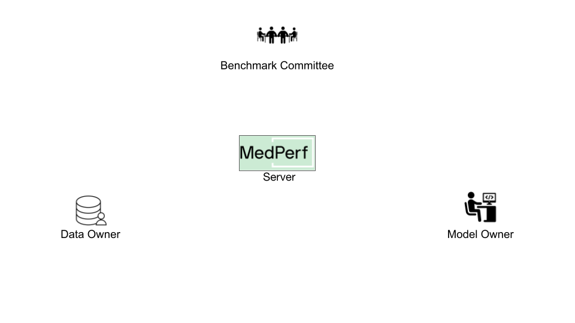

{class="tutorial-sticky-image-content"}
# Hands-on Tutorial for Model Owners




## Overview

In this guide, you will learn how a Model Owner can use MedPerf to take part in a benchmark. It's highly recommend that you follow [this](../mlcubes/mlcube_models.md) or [this](../mlcubes/gandlf_mlcube.md) guide first to implement your own model MLCube and use it throughout this tutorial. However, this guide provides an already implemented MLCube if you want to directly proceed to learn how to interact with MedPerf.

The main tasks of this guide are:

1. Testing MLCube compatibility with the benchmark.
2. Submitting the MLCube.
3. Requesting participation in a benchmark.

It's assumed that you have already set up the general testing environment as explained in the [setup guide](setup.md).



## 1. Test your MLCube Compatibility

{class="tutorial-sticky-image-content"}
Before submitting your MLCube, it is highly recommended that you test your MLCube compatibility with the benchmarks of interest to avoid later edits and multiple submissions. Your MLCube should be compatible with the benchmark workflow in two main ways:

1. It should expect a specific data input structure
2. Its outputs should follow a particular structure expected by the benchmark's metrics evaluator MLCube

These details should usually be acquired by contacting the Benchmark Committee and following their instructions.

To test your MLCube validity with the benchmark, first run `medperf benchmark ls` to identify the benchmark's server UID. In this case, it is going to be `1`.

Next, locate the MLCube. Unless you implemented your own MLCube, the MLCube provided for this tutorial is located in your workspace: `medperf_tutorial/model_mobilenetv2/mlcube/mlcube.yaml`.

After that, run the compatibility test:

```bash
medperf test run \
   --benchmark 1 \
   --model "medperf_tutorial/model_mobilenetv2/mlcube/mlcube.yaml"

```

Assuming the test passes successfuly, you are ready to submit the MLCube to the MedPerf server.

## 2. Submit the MLCube

{class="tutorial-sticky-image-content"}
### How does MedPerf Recognize an MLCube?



To prepare the files of the MLCube, run the following command ensuring you are in MedPerf's root folder:

```bash
python scripts/package-mlcube.py --mlcube medperf_tutorial/model_mobilenetv2/mlcube --mlcube-types model
```

This script will create a new folder in the MLCube directory, named `assets`, containing all the files that should be hosted separately.



### Submit the MLCube

The submission should include the URLs of all the hosted files. For the MLCube provided for the tutorial:

- The URL to the hosted mlcube manifest file is

   ```text
   {{ model_mlcube }}
   ```

- The URL to the hosted mlcube parameters file is

   ```text
   {{ model_params }}
   ```

- The URL to the hosted additional files tarball file is

   ```text
   {{ page.meta.model_add }}
   ```

Use the following command to submit:

```bash
medperf mlcube submit \
   --name my-model-cube \
   --mlcube-file "{{ model_mlcube }}" \
   --parameters-file "{{ model_params }}" \
   --additional-file "{{ page.meta.model_add }}"
```

The MLCube will be assigned by a server UID. You can check it by running:

```bash
medperf mlcube ls --mine
```

## 3. Request Participation

{class="tutorial-sticky-image-content"}
Benchmark workflows are run by Data Owners, who will get notified when a new model is added to a benchmark. You must request the association for your model to be part of the benchmark.

To initiate an association request, you need to collect the following information:

- The target benchmark ID, which is `1`
- The server UID of your MLCube, which is `4`.

Run the following command to request associating your MLCube with the benchmark:

```bash
medperf mlcube associate --benchmark 1 --model_uid 4
```

This command will first run the benchmark's workflow on your model to ensure your model is compatible with the benchmark workflow. Then, the association request information is printed on the screen, which includes an executive summary of the test mentioned. You will be prompted to confirm sending this information and initiating this association request.

#### What Happens After Requesting the Association?
{class="tutorial-sticky-image-content"}
When participating with a real benchmark, you must wait for the Benchmark Committee to approve the association request. You can check the status of your association requests by running `medperf association ls`. The association is identified by the server UIDs of your MLCube and the benchmark with which you are requesting association.

{class="tutorial-sticky-image-content"}

