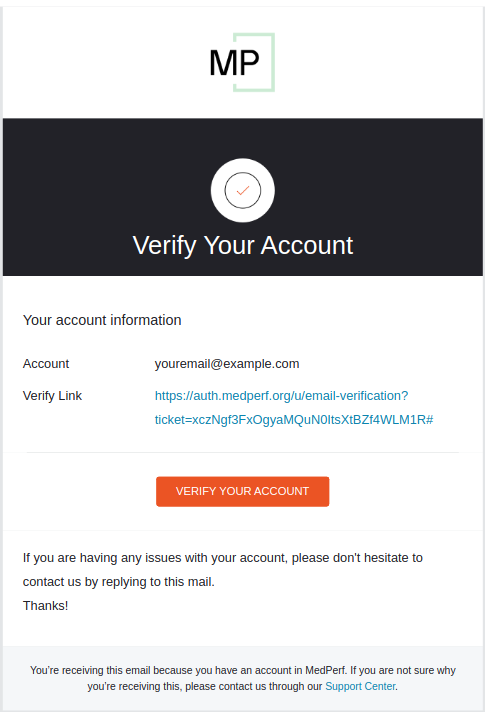

# Create your MedPerf Account

Create your account using the following command:

```bash
medperf auth signup
```

You will be asked to provide your email address and create a new password. Once you have successfully signed up, a verification link will be sent to your email. To verify your email, simply open your inbox and click on the provided link.



## What's Next?

- Get familiar with the MedPerf client by following the [hands-on tutorials](tutorials_overview.md).
- Understand and learn how to [build MedPerf MLCubes](../mlcubes/mlcubes.md).
