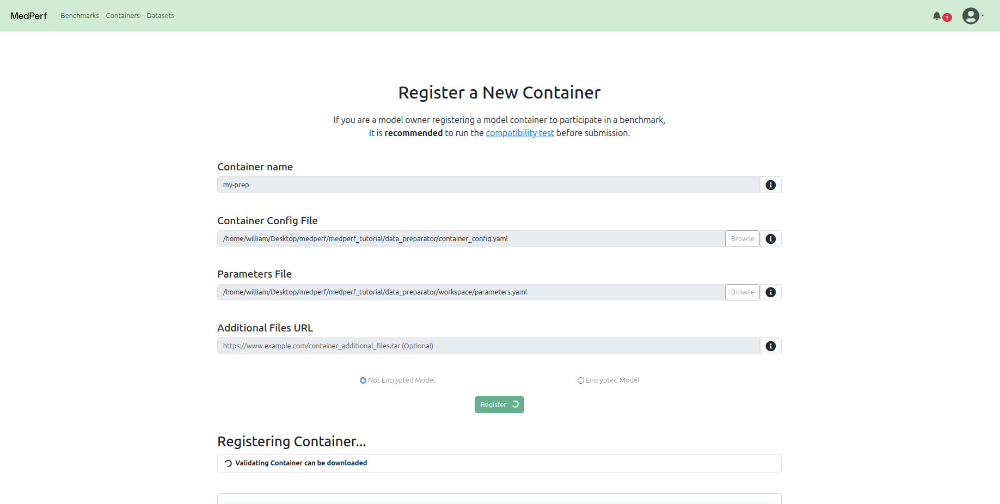
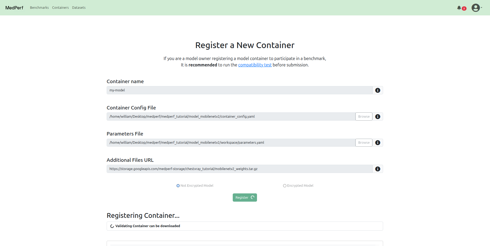
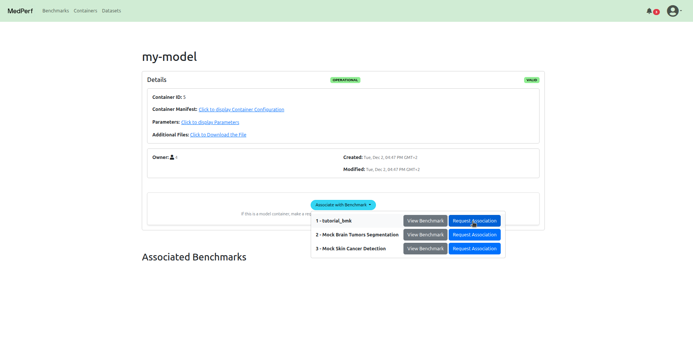
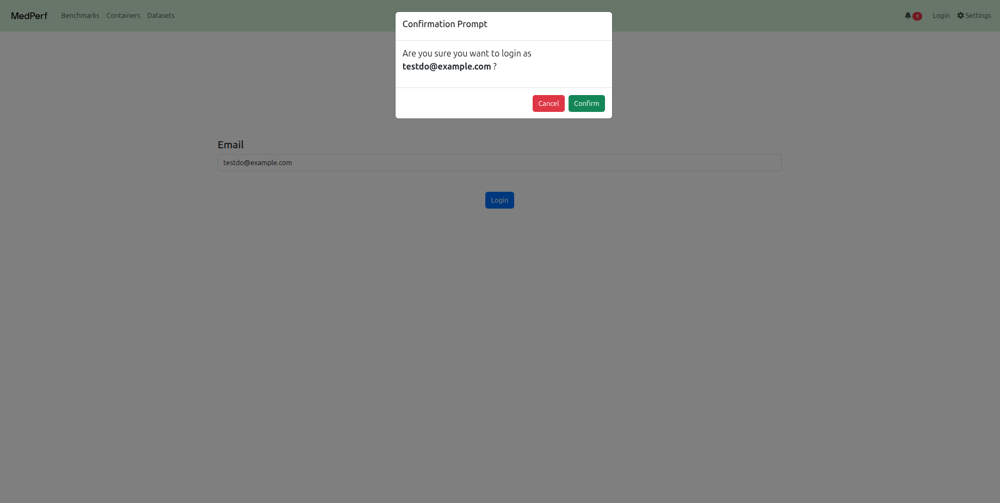
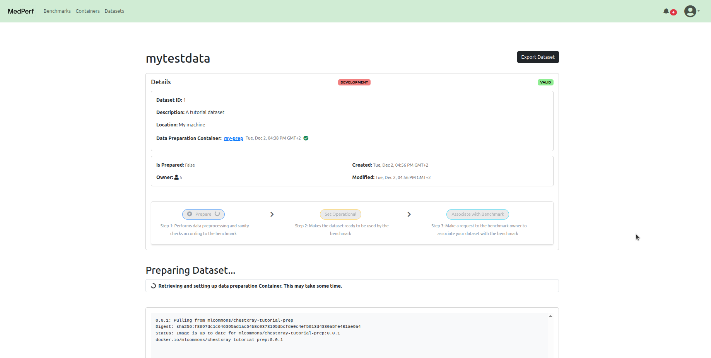
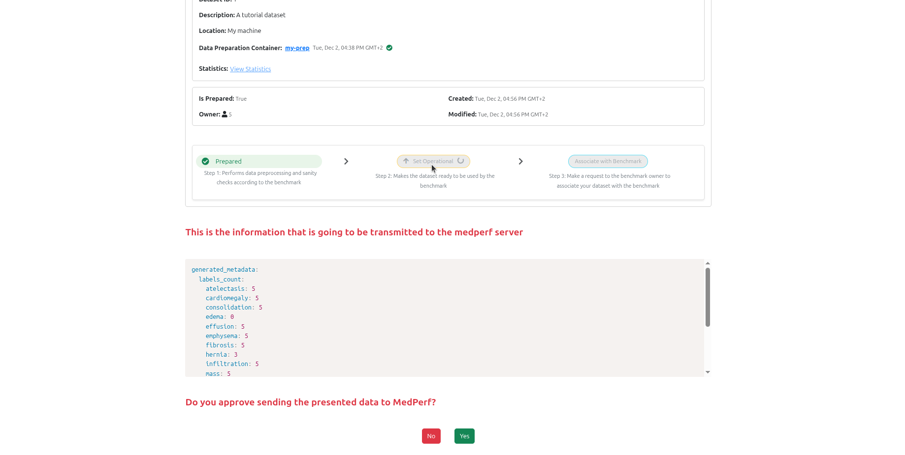
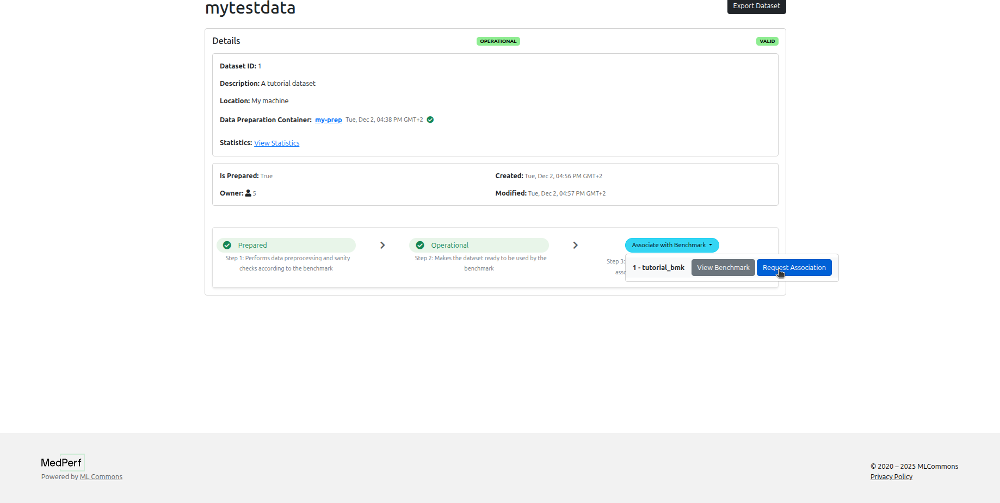
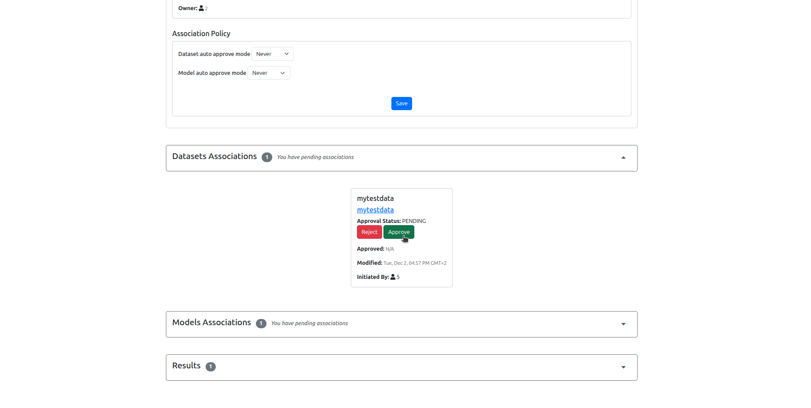
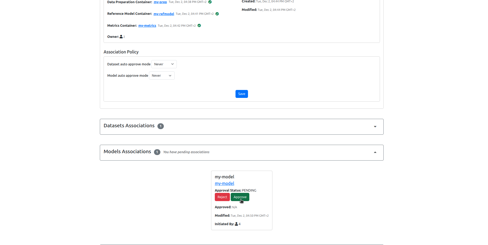

# Federated Evaluation Tutorial (WebUI version)

## Requirements

To run this tutorial, you need a machine with the following requirements:

- Internet access.
- Web browser (to connect to codespaces)

## Running in cloud via Github Codespaces

As the most easy way to play with the tutorials you can launch a preinstalled [Codespace](https://github.com/features/codespaces) cloud environment for MedPerf by clicking this link:

[](https://codespaces.new/mlcommons/medperf/tree/tutorial?devcontainer_path=.devcontainer%2Fwebui%2Fdevcontainer.json){target="\_blank"}

After opening the link, proceed to creating the codespace without changing any option. It will take around 7 minutes to get the codespace up and running. Please wait until you see the message `Medperf is ready for local usage` printed on the terminal.

## Run Medperf WebUI Local Server

In your codespaces terminal, run the following command to start the local webUI:

```bash
medperf_webui
```

You will see a long URL in the terminal. Click on the URL (CTRL + Click) to open the web UI in the browser.


## About the tutorial

You will be using MedPerf to do federated benchmarking for the task of chest X-ray classification. The data consists of chest X-ray images and their labels. You can take a look at the data located in this folder: `medperf_tutorial/sample_raw_data`.

Throughout the tutorial, you will play three roles:

- The benchmark owner who defines and manages the benchmark experiment.
- The model owner who will provide a model to be benchmarked.
- The data owner who will provide their data for benchmarking the model. (Note that the data stays on the data owner machine)

The following outlines the steps involved:

1. Benchmark Owner: Define and register the benchmark.
2. Model Owner: Register a model
3. Model Owner: Request participation in the benchmark
4. Data Owner: Register a dataset
5. Data Owner: Run data preparation.
6. Data Owner: Request participation
7. Benchmark Owner: Approve the participation requests
8. Data Owner: Run the benchmark
9. Data Owner: Submit the results
10. Benchmark Owner: View the results.

## 1. Benchmark Owner: Define and register the benchmark

First, login as the benchmark owner.

- Use the email `testbo@example.com`.


### Defining the benchmark Components

The implementation of a valid benchmark workflow is accomplished by implementing three Containers:

- **Data Preparator Container:** This container transforms raw data into a format ready to be ingested by AI models. In this tutorial, the data preparation container will transform chest x-ray images and labels into numpy arrays. You can take a look at the implementation in the following folder: `medperf_tutorial/data_preparator`.

- **Reference Model Container:** Provides an example AI model compatible with the benchmark, so that models respect the input data format and write predictions in a format specified by the benchmark owner. For this tutorial, you can take a look at the implementation in the following folder: `medperf_tutorial/model_custom_cnn`.

- **Metrics Container:** Evaluates model performance by comparing models predictions to the data ground truth labels. For this tutorial, the metrics container will calculate Accuracy and AUC metrics. You can take a look at the implementation in the following folder: `medperf_tutorial/metrics`.

Additionally, a demo/toy dataset should be provided as part of the benchmark to be used for testing the compatibility and validity of participating models.

All these four components are already ready to be used for this tutorial. Below, you will learn how to register them to the MedPerf server and then register the benchmark.

### Register the three Containers

In this section you will learn how to register the benchmark containers. When registering a container in MedPerf, you will be registering only metadata about the container. Other than providing a name to the container, you will be registering the following information for each container:

- A pointer to the container configuration file: This file describes how the container will be run. It includes a pointer to the docker image for docker-based containers, a pointer for the singularity image for singularity-based containers, and a list of volume mounts for the container. The MedPerf client, during runtime, will read the config file to pull the container image, and to also know what volumes to mount to the container.

- A pointer to the container parameters file: This file is optional; it is only required if you build your container in a way such that it expects a mounted parameters file. This is usually helpful in cases where you don't want to hardcode application-specific parameters inside the container. Most of the tutorial containers will have a parameters file.

- A pointer to the container "additional files" compressed file: Similar to the parameters file, this file is optional; it is only required if you build your container in a way such that it expects a mounted folder for some additional files such as model weights. This is usually helpful in cases where you don't want to hardcode application-specific assets, like model weights, inside the container. The model containers in this tutorial will expect an additional files folder.

Now, let's register the benchmark containers.

#### Data Preparator Container

Navigate to the `Containers` tab at the top, and click on the `Register a new container` button.

In this tutorial, for the Data Preparator container, the registration should include:

- The path to the container configuration file, which is:

    ```
    medperf_tutorial/data_preparator/container_config.yaml
    ```

- The path to the parameters file, which is:

    ```
    medperf_tutorial/data_preparator/workspace/parameters.yaml
    ```



#### Reference Model Container

Navigate back to the `Containers` tab at the top, and click on the `Register a new container` button.

In this tutorial, for the Reference Model container, the registration should include:

- The path to the container configuration file:

    ```
    medperf_tutorial/model_custom_cnn/container_config.yaml
    ```

- The path to the parameters file:

    ```
    medperf_tutorial/model_custom_cnn/workspace/parameters.yaml
    ```

- The URL to the hosted additional files tarball file, which includes model weights:

    ```
    https://storage.googleapis.com/medperf-storage/chestxray_tutorial/cnn_weights.tar.gz
    ```


#### Metrics Container

Navigate back to the `Containers` tab at the top, and click on the `Register a new container` button.

In this tutorial, for the Metrics container, the registration should include:

- The path to the container configuration file:

    ```
    medperf_tutorial/metrics/container_config.yaml
    ```

- The path to the parameters file:

    ```
    medperf_tutorial/metrics/workspace/parameters.yaml
    ```


Finally, now after having the containers registered, you can register the benchmark to the MedPerf server.

### Register the benchmark

Navigate to the `Benchmarks` tab at the top, and click on the `Register a new benchmark` button.

You need to keep at hand the following information:

- The Demo/Toy Dataset URL. Here, the URL will be:

    ```
    https://storage.googleapis.com/medperf-storage/chestxray_tutorial/demo_data.tar.gz
    ```

- The names you used for the three containers that you have registered in the previous steps.


## 2. Model Owner: Register a model

- Logout, then use the email `testmo@example.com` to login as the model owner.


The implementation of the model container that will we will be registering in this section can be found in the following folder: `medperf_tutorial/model_mobilenetv2`.

### Register your model

Navigate to the `Containers` tab at the top, and click on the `Register a new container` button.

In this tutorial, for the model owner's container, the registration should include:

- The path to the container configuration file is:

    ```
    medperf_tutorial/model_mobilenetv2/container_config.yaml
    ```

- The path to the parameters file is:

    ```
    medperf_tutorial/model_mobilenetv2/workspace/parameters.yaml
    ```

- The URL to the hosted additional files tarball file (which contains the model weights):

    ```
    https://storage.googleapis.com/medperf-storage/chestxray_tutorial/mobilenetv2_weights.tar.gz
    ```



## 3. Model Owner: Request participation in the benchmark

You must request to associate your model with the benchmark in order to be part of it.

To initiate an association request, you need to keep at hand the following information:

- The target benchmark name.
- Your container's name.

Then, visit your container's detail page, and start the association request by clicking on the `Associate with a benchmark` button.



## 4. Data Owner: Register a dataset

- Logout, then use the email `testdo@example.com` to login as the data owner.



### Register your dataset

Navigate to the `Datasets` tab at the top, and click on the `Register a new dataset` button.

You will be registering the dataset located at `medperf_tutorial/sample_raw_data`.

To register your dataset, you need to keep at hand the following information:

- A name you wish to have for your dataset.
- A small description of the dataset.
- The source location of your data (e.g., hospital name).
- The path to the data records (here, it is `medperf_tutorial/sample_raw_data/images`).
- The path to the labels of the data (here, it is `medperf_tutorial/sample_raw_data/labels`)
- The benchmark that you wish to participate in. This ensures your data in the next step will be prepared using the benchmark's data preparation container.

!!! note
    You will be submitting general information about the data, not the data itself. The data never leaves your machine.


## 5. Data Owner: Run data preparation

Click on the `prepare` button in your dataset page.



### Set dataset into operational mode

After running preparation, click on the `set opertional` button to mark your dataset as ready for benchmarking. This will also upload some statistics calculated on the dataset according to the benchmark owner's requirement. For the benchmark of this tutorial, the statistics will be the number of cases and the label counts.



## 6. Data Owner: Request participation

Click on the `associate with benchmark` button in your dataset page.



You won't be able to run the benchmark until the benchmark owner approves your association request.

## 7. Benchmark Owner: Approve the participation requests

Logout, then login as the benchmark owner, navigate to your benchmark page, then accept participation requests from the model owner and from the data owner.





## 8. Data Owner: Run the benchmark

Now, Logout, then login as the data owner, click on the `Datasets` tab, navigate to your dataset page, and run the benchmark on your data.

You will see that the reference model has been already run during the association. Click on the `Run` button of the other model to run it.


## 9. Data Owner: Submit the results

Now you can click on the `Submit` button for each model to submit the results to the MedPerf server, so that the benchmark owner can view them. You can click `View Results` before submitting as well.


## 10. Benchmark Owner: View the results

Now, logout, then login as the benchmark owner, navigate to your benchmark page, and you can see the results.


**This concludes our tutorial!**
