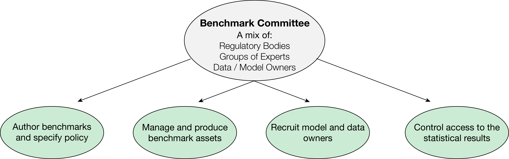
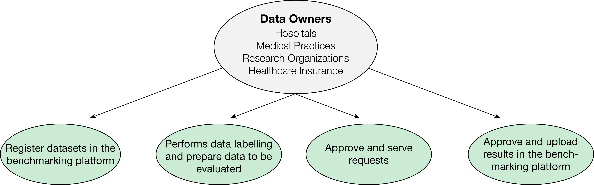
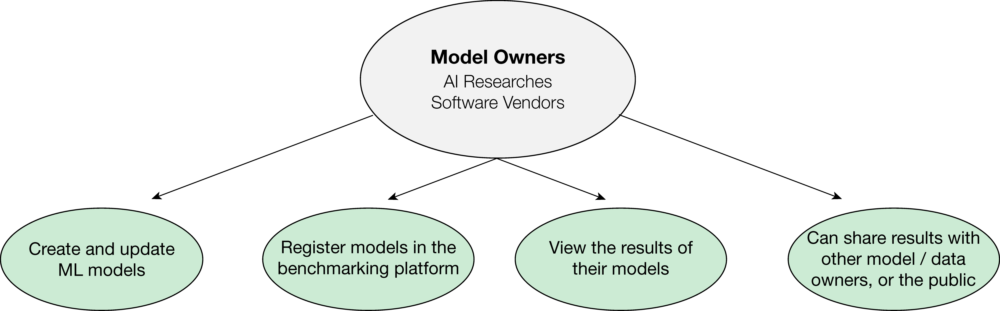

# User Roles and Responsibilities

Here we introduce user roles at MedPerf. Depending on the objectives and expectations a user may have multiple roles.

## Benchmark Committee

May include healthcare stakeholders (e.g., hospitals, clinicians, patient advocacy groups, payors, etc.), regulatory bodies, data providers and model owners wishing to drive the evaluation of AI models on real world data. While the *Benchmark Committee* does not have admin privileges on MedPerf, they have elevated permissions regarding benchmark assets (e.g., task, evaluation metrics, etc.) and policies (e.g., participation of model owners, data providers, anonymizations)

## Data Providers

May include hospitals, medical practices, research organizations, and healthcare payors that own medical data, register medical data, and execute benchmarks.

## Model Owners

May include ML researchers and software vendors that own a trained medical ML model and want to evaluate its performance against a benchmark.

## Platform Providers

Organizations like [MLCommons](https://mlcommons.org/en/){target="\_blank"} that operate the MedPerf platform enabling benchmark committees to develop and run benchmarks.

