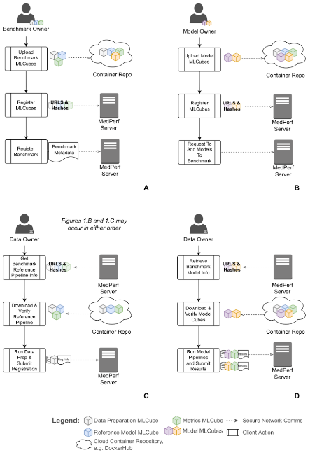
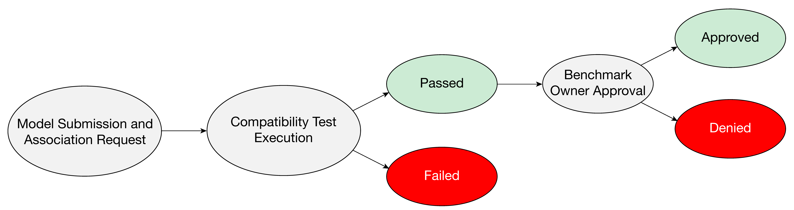
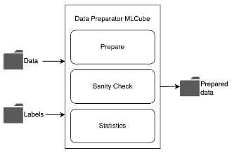
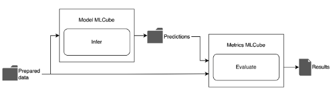

# MedPerf Benchmarking Workflow 

## Creating a User

Currently, the MedPerf administration is the only one able to create users, controlling access to the system and permissions to own a benchmark. For example, if a hospital (Data Provider) wants to have access to MedPerf, they need to contact the MedPerf administrator to add a user. You check more details on how to create a user, host the server, and install the CLI/MedPerf Dependencies [here](general_instructions.md#general-instructions).

## Establishing a Benchmark Committee

The benchmarking process starts with establishing a benchmark committee of healthcare stakeholders (experts, committee), which will identify a clinical problem where an effective ML-based solution can have a significant clinical impact. 

## Recruiting Data and Model Owners

The benchmark committee recruits Data Providers and Model Owners either by inviting trusted parties or by making an open call for participation. A higher number of dataset providers recruited can maximize diversity on a global scale. 

## MLCubes Submission

MLCubes are the building blocks of an experiment. They are required in order to create a benchmark, thus the three MLCubes (Data Preparator MLCube, Model MLCube, and Metrics MLCube) need to be submitted. Check [this section](instructions_model_owners.md#submitting-your-mlcube) to understand how to submit your MLCubes. 

The submission process is described as follows:

1. Wrap your logic in an MLCube (with the appropriate MLCube interface);
2. Host the following files on file server: 
    1. the image file (can be a tarball on a file server, or hosted in an image repository, e.g. dockerhub). The image file is only required if not using an image repository that MLCube knows how to handle;
    2. the mlcube.yaml file that describes the image (currently only GitHub hosting is supported);
    3. the parameters.yaml file (also GitHub hosted-only) that defines the specific configuration (e.g. hyper-parameters if the MLCube supports multiple options); 
    4. the additional files tarball, if used (e.g. model weights)
3. Provide the following information to the server (via the MedPerf client command "mlcube submit", IIRC):

    "name": "string",

    "git_mlcube_url": "string",

    "git_parameters_url": "string",

    "image_tarball_url": "string",

    "additional_files_tarball_url": "string",

    "user_metadata": { },

**Note:** At present, all MLCubes require a GitHub repository to host their mlcube.yaml and parameters.yaml files. The image file is only required if not using an image repository that MLCube knows how to handle and hashes can be passed manually or computed at submission-time by the CLI (preferred).

**Note:** The URLs of the files hosted on github must be UserContent github URLs (domain raw.githubusercontent.com). Below are the steps to get this URL for a specific file:

1. Open the github repository and ensure you are in the correct branch
2. Click on “Commits” at the right top corner of the repository explorer.
3. Locate the latest commit, it is the top most commit.
    1. If you are targeting previous versions of your file, make sure to consider the right commit.
4. Click on this button “&lt;>” corresponding to the commit (Browse the repository at this point in the history).
5. Navigate to the file of interest.
6. Click on “Raw”.
7. Copy the url from your browser.

## Benchmark Submission

After submitting the Data Preparator MLCube, Model MLCube, and Metrics MLCube, the Benchmark Committee is now capable of creating a benchmark. Once a benchmark is submitted, the Medperf admin must approve it before it can be seen by other users. Check [this section](instructions_benchmark_committee.md#submitting-your-benchmark) to get the details on how to submit a benchmark. 

## Submitting and Associating Additional Models

Once a reference benchmark is submitted by the Benchmark Committee, any user can submit their own Model MLCubes and request an association with the benchmark (check step 4 in the section “[Preparing a Dataset](instructions_data_owners.md#preparing-a-dataset)” if you are a Data Provider, or check [this section](instructions_model_owners.md#requesting-association-to-a-benchmark) if you are a Model Owner). This association request executes the benchmark locally with the given model to ensure compatibility. If the model successfully passes the compatibility test, and its association is approved by the Benchmark Committee, then it becomes part of the benchmark. 

## Dataset Preparation and Association

Data Providers that want to be part of the benchmark can prepare their own datasets, register them and associate them with the benchmark. 

After downloading MLCube in their cloud or on-prem and verifying it is the right piece of software, Data Providers will run the Data Preparator MLCube so that they can extract, preprocess, label, and review the datasets for legal/ethical compliance. 

 

If the execution is successful and the dataset has successfully passed the compatibility test, and its association is approved by the Benchmark Committee, then it’s registered with the benchmarking platform and associated with that specific benchmark. 

## Executing the Benchmark

Once the benchmark, dataset, and models are registered to the benchmarking platform, the Benchmark Committee notifies Data Providers that models are available for benchmarking, thus they can generate results by executing a model with their local data (check the “[Running an Experiment](instructions_data_owners.md#running-an-experiment)” section to understand how to run an experiment). 

This procedure retrieves the specified Model MLCube and runs it with the indicated prepared dataset to generate predictions. The Model MLCube will execute the machine learning inference task to generate predictions based on the prepared data. 

Finally, the Metrics MLCube is retrieved to compute metrics on the predictions. Once results are generated, the user can submit them to the platform.

## Release Results to Participants

The benchmarking platform aggregates the results of running the models against the datasets and shares them according to the Benchmark Committee's policy.

The sharing policy controls how much of the data is shared, ranging from a single aggregated metric to a more detailed model-data cross product. A public leaderboard is available to Model Owners who produce the best performances.
