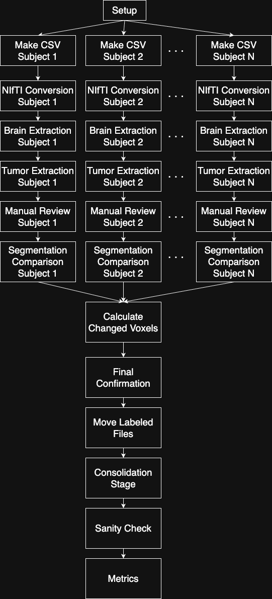
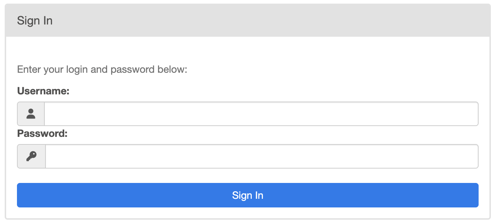
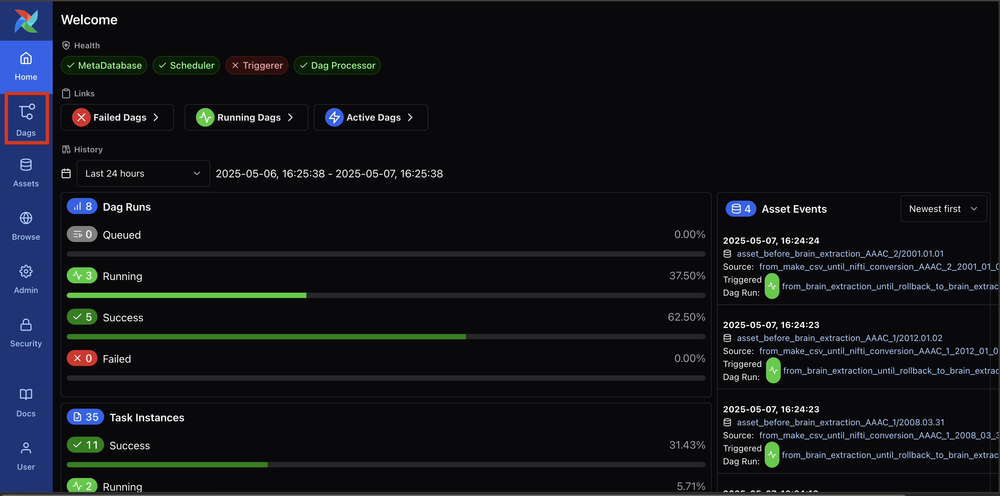
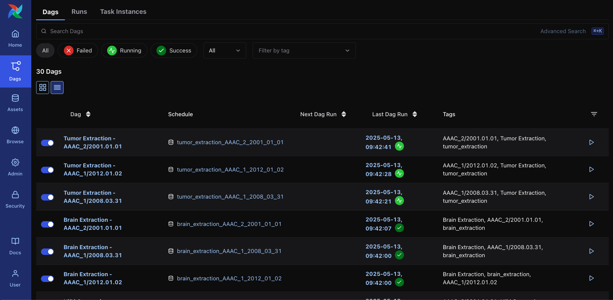
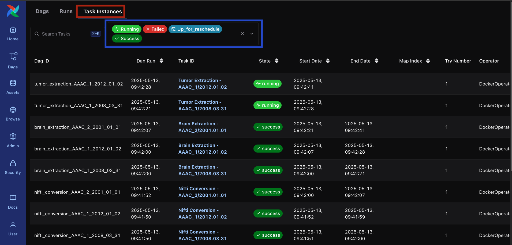
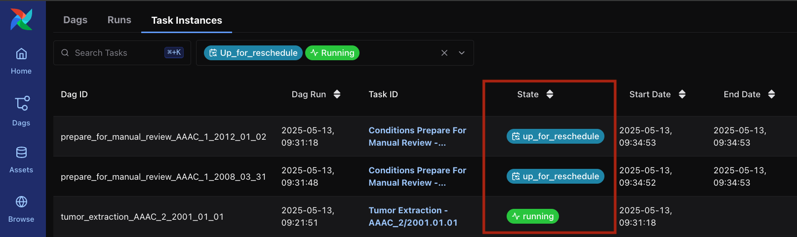
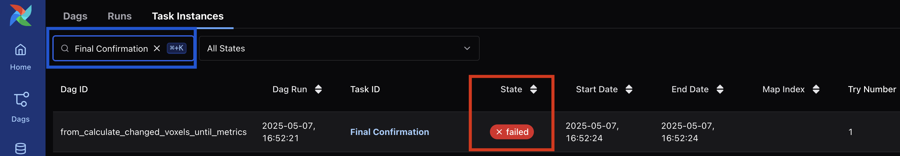
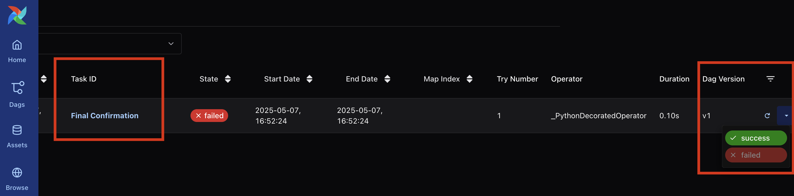
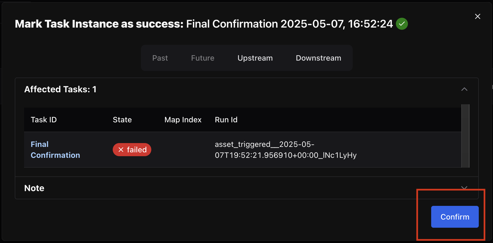

# RANO Data Preparation

Here, a modified version of the data preparation pipeline used in the RANO study is presented as a use case for the YAML Pipelines in Airflow. The YAML file defining this pipeline is located at `./workflow.yaml`, with auxiliary Python code used to evaluate conditional steps in the pipeline located at `additional_files/conditions.py` and `additional_files/subject_definition.py`. A slightly modified version of the pipeline used for development and testing purposes is located at `./workflow_dev.yaml`.

[Section 1](#1-preparing-to-run-the-pipeline-with-the-developement-dataset) of this README describes the initial setup to run the development pipeline, while [Section 2](#2-preparing-to-run-the-pipeline-with-real-data) describes how to do the initial setup to run the pipeline on real data. The following sections then describe how to properly execute the pipeline via MedPerf and monitor the pipeline on Airflow, regardless of whether the development or real pipeline is used.

## 1. Preparing to run the Pipeline with the Developement dataset

The following steps allow running the development pipeline in a local environment:

- Ensure you have a valid local MedPerf installation. Detailed instructions are available in the [Official MedPerf Documentation for Installation](https://docs.medperf.org/getting_started/installation/).
  
- Start a local MedPerf development server. Detailed instructions are available in the [Official MedPerf Documentation for local server setup](https://docs.medperf.org/getting_started/setup/#install-the-medperf-client).

- (Optional step) If logged into a real MedPerf user, first logout.
```bash
medperf auth logout
```

- Log into the test Benchmark Owner user.
```bash
medperf auth login -e testbo@example.com
```

- (Optional step) Reset the local development server databse by execution the following command inside the `server` directory at the roost of this repository:
```bash
sh reset_db.sh
```

- Seed the server with the Development RANO Workflow. This can be done by executiong the following command, inside the `server` directory at the root of this repository:
```bash
python seed.py --cert cert.crt --demo rano
```

- Confirm the seeding process was succesful by executing the following command in any directory:
```bash
medperf container ls
```

The output should be similar to what's shown below:
```text
  UID  Name                State      Registered
-----  ------------------  ---------  ------------
    1  MedPerf CA          OPERATION  True
    2  rano_workflow_prep  OPERATION  True
```

Note the `UID` field of the `rano_workflow_prep` workflow. It should be `2` if the local database was reset prior to seeding, but may be a different value if no reset was done. This UID will be used when running the data preparation step.

- Get the RANO development dataset by downloading and extracting (sha256: 701fbba8b253fc5b2f54660837c493a38dec986df9bdbf3d97f07c8bc276a965):
<https://storage.googleapis.com/medperf-storage/rano_test_assets/dev.tar.gz>

- Extract the `input_data` directory into any directory you like, but keep note of its location. It will be used later.
  - The other files and directories inside the tarball may be safely deleted or ignored.


## 2. Preparing to run the Pipeline with Real data

The following steps allow running the development pipeline in a local environment:

- Ensure you have a valid local MedPerf installation. Detailed instructions are available in the [Official MedPerf Documentation for Installation](https://docs.medperf.org/getting_started/installation/).
  
- Start a local MedPerf development server. Detailed instructions are available in the [Official MedPerf Documentation for local server setup](https://docs.medperf.org/getting_started/setup/#install-the-medperf-client).

- (Optional step) If logged into a real MedPerf user, first logout.
```bash
medperf auth logout
```

- Log into the test Benchmark Owner user.
```bash
medperf auth login -e testbo@example.com
```

- (Optional step) Reset the local development server databse by execution the following command inside the `server` directory at the roost of this repository:
```bash
sh reset_db.sh
```

- Register the real dataset workflow in MedPerf. **Inside the same directory as this README file**, run the following command:
```bash
medperf container submit --name rano_workflow --container-config-file /workflow.yaml --parameters-file ./workspace/parameters.yaml --additional-file https://storage.googleapis.com/medperf-storage/rano_test_assets/dev_models_and_more.tar.gz --operational
```

- Confirm the seeding process was succesful by executing the following command in any directory:
```bash
medperf container ls
```

The output should be similar to what's shown below:
```text
  UID  Name                State      Registered
-----  ------------------  ---------  ------------
    1  MedPerf CA          OPERATION  True
    2  rano_workflow       OPERATION  True
```

Note the `UID` field of the `rano_workflow` workflow. It should be `2` if the local database was reset prior to seeding, but may be a different value if no reset was done. This UID will be used when running the data preparation step.

- Prepare your input data according to [Section 2.1](#21-structuring-your-data) below.

### 2.1. Structuring your data

You may create your `input_data` directory anywhere, but please ensure that it is in a location with relatively fast read/write access and with at least 2x more free disk space than your dataset currently occupies. Inside the `input_data` directory, your data needs to follow a folder hierarchy where images are separated by \<PatientID>/\<Timepoint>/\<Series>.

**Please note**: For the RANO study, Series-level folders must use the following abbreviations: t2f (T2-weighted FLAIR), t1n (T1-weighted non-contrast), t1c (T1-weighted with contrast), and t2w (T2-weighted). For more information about the required series, please refer to the FeTS 2.0 manual. PatientID and Timepoint must be unique between and within patients, respectively, and Timepoint should be sortable into chronologic order.

```
.
├── input_data
│   ├── AAAC_0
│   ├── 2008.03.30
│   │   ├── t2f
│   │   ├── t2_Flair_axial-2_echo1_S0002_I000001.dcm
│   │   │   └── ...
│   │   ├── t1n
│   │   │   ├── t1_axial-3_echo1_S0003_I000001.dcm
│   │   │   └── ...
│   │   ├── t1c
│   │   │   ├── t1_axial_stealth-post-14_echo1_S0014_I000001.dcm
|   │   │   │   └── ...
│   │   │   └── t2w
│   │   │       ├── T2_SAG_SPACE-4_echo1_S0004_I000001.dcm
│   │   │       └── ...
```

## 3. Registering your dataset
Your dataset must be registered into MedPerf for pipeline execution. The following command my be used to register the dataset on MedPerf
```bash
medperf dataset --name RANODataset --data_path <path_to_input_data_directory> --labels_path <path_to_the_same_input_directory> --data_prep <UID_of_data_preparation_workflow> -y 
```
Make sure to substitute in the proper values for the `--data_path`, `--labels_path` and `--data-prep` arguments according to the setup done in either [Section 1](#1-preparing-to-run-the-pipeline-with-the-developement-dataset) or [Section 2](#2-preparing-to-run-the-pipeline-with-real-data).

Confirm your dataset's UID by running the command
```bash
medperf dataset ls --mine
```

The output should be similar to what is shown below. If a local database reset was run at the start of the tutorial, it should be `UID` `1`. Keep note of the dataset UID, as it will be used in [Section 4](#4-running-the-rano-pipeline-via-medperf)
```text
  UID  Name      Data Preparation Container UID  State        Status    Owner
-----  ------  --------------------------------  -----------  --------  -------
    1  RANO                                   2  DEVELOPMENT
```


## 4. Running the RANO Pipeline via MedPerf
Once the dataset is registered, the pipeline may be executed by running
```bash
medperf dataset prepare --data_uid <dataset_UID> -y
```
Make sure to substitute in the dataset UID seen in [Section 3](#3-registering-your-dataset). MedPerf will then being pulling the necessary Docker iamge and then immediately run Airflow. [Section 5](#5-pipeline-overiew) will give a general view of the pipeline, while [Section 6](#6-monitoring-in-airflow) will go on details of how to monitor the pipeline in Airflow.

## 5. Pipeline Overiew
A general view of the pipeline is shown in the Figure below. A initial setup creating required directories is performed at first. Then, the pipeline will run NIfTI Conversion for multiple subjects in parallel. For each subject, once NIfTi conversion is completed, the pipeline will automatically run the Brain Extraction and Tumor Extraction stages and then await for manual confirmation (see [Section 5.1](#51-manual-approval-steps) for instructions regarding manual confirmation). The `per subject: true` configuration present in multiple steps of the pipeline signifies that this splitting per subject must be done at these steps.



When the parser converts the YAML file into Airflow, each box in the above Figure is converted into a Directed Acyclic Graph (DAG) in Airflow. This results in the Airflow form of the pipeline being constructed as multiple DAGs, which can be though of as a grouping of one or more data processing steps. 

## 6. Monitoring in Airflow
Airflow’s Web UI can be used to monitor the Pipeline while it is running. The WebUI will be ready for accessing when a message similar to the image below appears in the terminal used to run DataPreparation:
```text
Starting Airflow components
Airflow components successfully started
MedPerf has started executing the Data Pipeline rano_workflow_prep via Airflow.
Execution will continue until the pipeline successfully completes.
The Airflow UI is available at the following link: http://localhost:8080.
Please use the following credentials for interacting with the Airflow WebUI
-------------------------------------------------------
User: SOME_USERNAME_HERE
Password: RANDOM_PASSWORD_HERE
-------------------------------------------------------
Note that the password value will change every time Airflow is restarted via MedPerf.
If this process must be stopped prematurely, please use the Ctrl+C command!
```

Keep note of the values that appear in your terminal for `SOME_UERNAME_HERE` and `RANDOM_PASSWORD_HERE`. They will be used to access the Airflow WebUI. The WebUI can be accessed via port 8080 in the Machine where Airflow is running. If running locally, you can simply open http://localhost:8080/ on your Browser to access the UI. Use the `SOME_UERNAME_HERE` and `RANDOM_PASSWORD_HERE` from the terminal output to login. Note that the password will change every time Airflow is started via MedPerf.



Once logged in, the Airflow home screen will be displayed, as shown below. You can click on the DAGs button, in red in the figure, to switch to the DAGs view.



A list of all currently loaded Airflow DAGs will be displayed, as shown below. The pipeline itself consists of multiple DAGs and each DAG maps to one of the `steps` defind in the YAML version of the Pipeline. Each DAG is the corresponding step name, both in its raw format from the YAML file (`some_step`) and in a more readable format (`Some Step`) and, in case of steps with `per_subject: true`, also by the Subject ID and Timepoint.



A view of Airflow Task Instances, which are the unit of execution used by Airflow, may be displayed by clicking the `Task Instances` button at the top of the screen. In this screen, Task Instances may be filtered by their state. We recommend filtering by `Running`, `Failed`, `Success` and `Up for Reschedule` states. The `Up for Reschedule` state is relevant for the Manual Approval Steps discussed in [Section 5.1](#51-manual-approval-steps). The Figure below shows a view of Task Instances with these filters applied, with the `Task Instances` button showcased in red and the state filters in blue.



### 5.1 Manual Approval Steps
The automatic Tumor Segmentations must be manually validated before the Pipeline concludes. To help with finding the tasks that are awaiting for Manual Approval, we recomend going into the Task Instance view described previously and filter by `Up for Reschedule` tasks. The pipeline automatically creates the `Conditions Prepare for Manual Review` task to evaluate the `if` fields from the `prepare_for_manual_review` step defined in the YAML file. While awating for approval, these tasks remain in the `Up for Reschedule` state. The Figure below shows a Task Instance list view in this situation, with the Task IDs and State in red:



In the Figure above, Subjects AAAC_1/2008.03.031 and AAAC_1/2012.01.02 are ready for manual review, signalled by the `State`  (in blue) column having the status `Up for Reschedule`. This status means that none of the conditions defined in step `prepare_for_manual_review` of the YAML file (`dags_from_yaml/rano.yaml`) have been met yet, and therefore the pipeline is waiting for their manual completion by a user. The procedure for Manual Review is described in Sections [5.1](#51-manual-approval-steps---tumor-segmentation) and [5.2](#52-brain-mask-correction). Subject AAAC_2/2001.01.01 on the other hand, has a currently running task, signalled by the `Running` state, and therefore is not ready for manual review yet.

#### 6.1.1 Tumor Segmentation
Once the segmentation for a given subject is ready for review, it will be available at the following path:

```
{MEDPERF_DATA_DIR}/{DATASET_UID}/data/manual_review/tumor_extraction/{SUBJECT_ID}/{TIMEPOINT}/under_review/{SUBJECT_ID}_{TIMEPOINT}_tumorMask_model_0.nii.gz
```

In this path `{MEDPERF_DATA_DIR}` MedPerf data directory, located at `~/.medperf/data/localhost_8000` if running the local development server. `{DATASET_UID}` is the UID of the registered dataset and shoul be `1` if a server reset was run prior to this tutorial,`{SUBJECT_ID}` and `{TIMEPOINT}` must be substituted for the corresponding SubjectID and Timepoint of each data point. Note that this is in the `under_review` directory, signalling the tumor segmentation has not been reviewed yet. For example, for subject AAAC_2 and timepoint 2001.01.01 the complete path would be:

```
{MEDPERF_DATA_DIR}/{DATASET_UID}/data/manual_review/tumor_extraction/AAAC_2/2001.01.01/under_review/AAAC_2_2001.01.01_tumorMask_model_0.nii.gz
```

The tumor segmentation can be reviewed with the software of your choice and, if necessary, corrections can be made. Once the review is finished, the file must be moved to the adjacent `finalized` directory. The complete path to the `finalized` file is, then

```
{MEDPERF_DATA_DIR}/{DATASET_UID}/data/manual_review/tumor_extraction/{SUBJECT_ID}/{TIMEPOINT}/finalized/{SUBJECT_ID}_{TIMEPOINT}_tumorMask_model_0.nii.gz
```

Note that this is in the `finalized` directory, signalling the review has been done. Once the Tumor Segmentation is in the `finalized` directory, the pipeline will automatically detect it and proceed for this subject. ***IMPORTANT!! Do NOT change the filename when moving the file into the finalized directory!*** The pipeline will only detect the reviewed Tumor Segmentation if it keeps the exact same filename.

Please do this review process for all subjects in the study. If the brain mask itself must be corrected for any subjects, please refer to [Section 5.1.2](#512-brain-mask-correction). Note that modifying the Brain Mask of a Subject will cause the pipeline to rollback to the Brain Extraction step corresponding to that subject to run again, after which the given Tumor Segmentation must be manually approved once ready.

#### 6.1.2 Brain Mask Correction

If the automatic brain mask is correct, no action from this section is required. However, it is also possible to make corrections to the automatic brain mask, if necessary. **Note that if the Brain Mask is modified, the pipeline will go back to the Brain Extraction stage for this subject, then run Tumor Extraction and await for manual approval once again oncfe the Tumor Extraction is completed.** Once the pipeline reaches the manual approval step for a given subject/timepoint, the brain mask file will be located at the path below:

```
{MEDPERF_DATA_DIR}/{DATASET_UID}/data/manual_review/brain_mask/{SUBJECT_ID}/{TIMEPOINT/under_review/brainMask_fused.nii.gz
```

In this path `{MEDPERF_DATA_DIR}` MedPerf data directory, located at `~/.medperf/data/localhost_8000` if running the local development server. `{DATASET_UID}` is the UID of the registered dataset and shoul be `1` if a server reset was run prior to this tutorial, `{SUBJECT_ID}` and `{TIMEPOINT}` must be substituted for the corresponding SubjectID and Timepoint of each data point. Note that this is in the `under_review` directory, signalling the tumor segmentation has not been reviewed yet. 

The brain mask can be reviewed and corrected with the software of your choice and, if necessary, corrections can be made. Once the corrections are finished, the file must be moved to the adjacent `finalized` directory. The complete path to the finalized file is, then:

```
{MEDPERF_DATA_DIR}/{DATASET_UID}/datamanual_review/brain_mask/{SUBJECT_ID}/{TIMEPOINT/finalized/brainMask_fused.nii.gz
```

***IMPORTANT!! Do NOT change the filename when moving the file into the finalized directory!*** The pipeline will only detect the corrected Brain Mask if it keeps the exact same filename.

#### 6.2 Final Confirmation
There is also a manual confirmation step towards the end of the pipeline (step ID `final_confirmation`, of type  `manual_approval`). When converted into an Airflow task, this step results into a task that always fails and must be manually set as Success by the user. **Before proceeding with this step, *make sure to review and Tumor Segmentations as per [Section 6.1.1](#611-manual-approval-steps---tumor-segmentation) and ensure you approve all of the results, along with necessary corrections to Brain Masks ([Section 6.1.2](#612-brain-mask-correction) if any are necessary.***

Once all results are reviewed, log into Airflow's Web UI. Go into the Task Instance View and locate the Task Instance named `Final Confirmation`. A filter by may be used, as shown in the Figure below, in blue. The task state will be `Failed`, as shown in red in the figure. This is normal, as this task is a manual approval step and therefore must be manually changed to success for approval.



***IMPORTANT!!* This task will *NOT* show up if all Manual Reviews are not done yet!** If you are unable to find the `Final Confirmation` task instance, make sure you have completed all the Manual Review steps outlind in [Section 5.1](#51-manual-approval-steps).

If task is in the `Failed` state, it is ready for review. **If you have already validated all the Tumor Segmentations**, scroll your display all the way to the right, revealing a small drop-down arrow. Click the arrow, then click `Success` to open a confirmation prompt. The `Note` tab may be optionally expanded to add a Note to this task, if desired. Finally click `Confirm` to approve the results.  The two figures below illustrate this process.





Once this procedure is done, the pipeline will proceed to its final steps and conclusion.

## 7. Output Data

The outputs of the pipeline, upon its conclusion, are as follows:

- The `report.yaml` file, located at `{MEDPERF_DATA_DIR}/{DATASET_UID}/data/report.yaml` which is updated every minute with the completion percentages of each step defined on the Pipeline YAML file (`./workflow.yaml` or `/.workflow_dev.yaml`). Its contents are uploaded to the local MedPerf server. In a real use case, the contents are uploaded to the production MedPerf server and are used for monitoring the progression of data preparation at the different sites running data preparation. Note that the `report.yaml` file contains only a summary of pipeline status and progression completion, not any actual data.

- The `{MEDPERF_DATA_DIR}/{DATASET_UID}/metadata` directory contains metadata YAML files for each subject, extracted from the initial DICOM data.

- The `{MEDPERF_DATA_DIR}/{DATASET_UID}/labels` directory contains the final tumor segmentations for each subject.

- The `{MEDPERF_DATA_DIR}/{DATASET_UID}/data` directory contains two different outputs.
  - The NIfTi files obtained for each subject after Brain Extraction, located at `{MEDPERF_DATA_DIR}/{DATASET_UID}/data/{SUBJECT_ID}/{TIMEPOINT}` for each subject/timepoint combination.
  - A `splits.csv` file detailing whether each subject was separated into the training or validation data sets.
  - A `train.csv` file containing only subjects in the training dataset.
  - A `val.csv` file containing only subjects in the validation dataset. 
